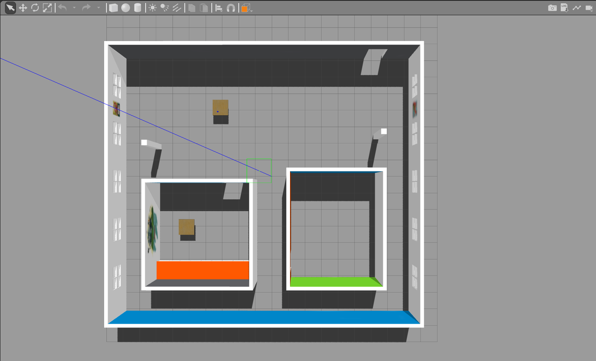
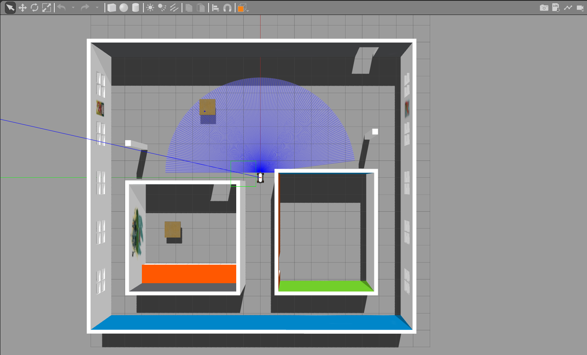
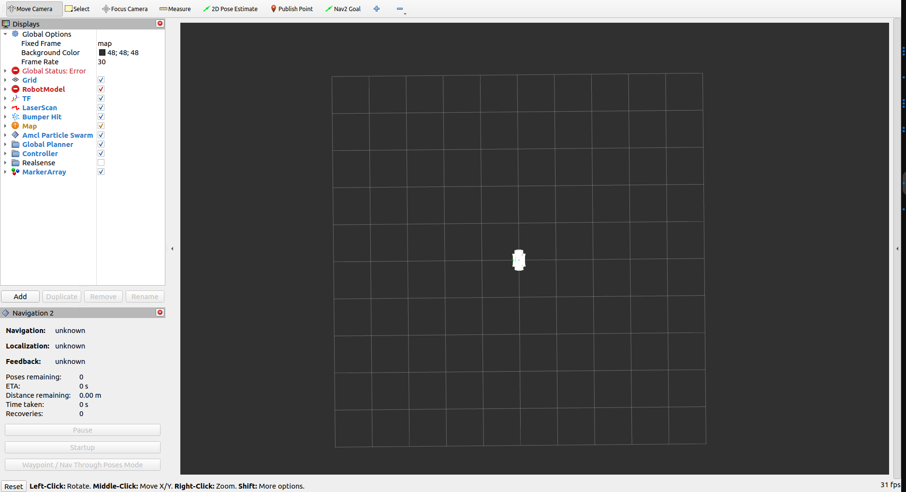
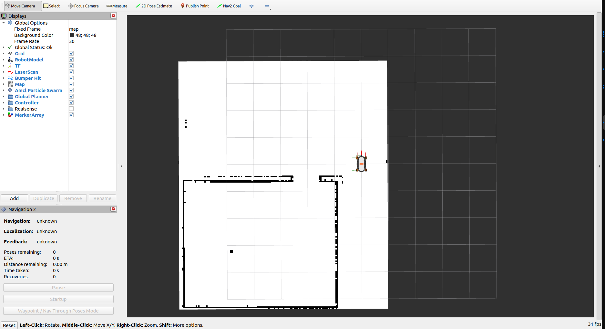
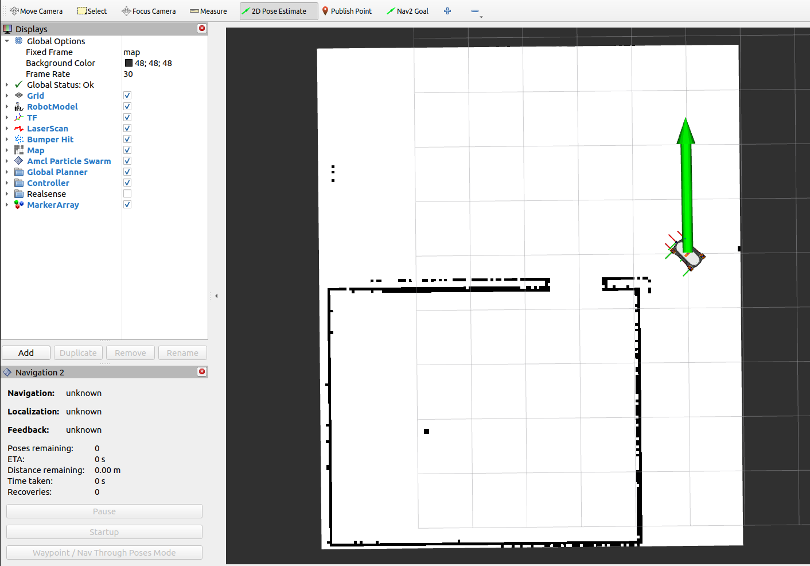
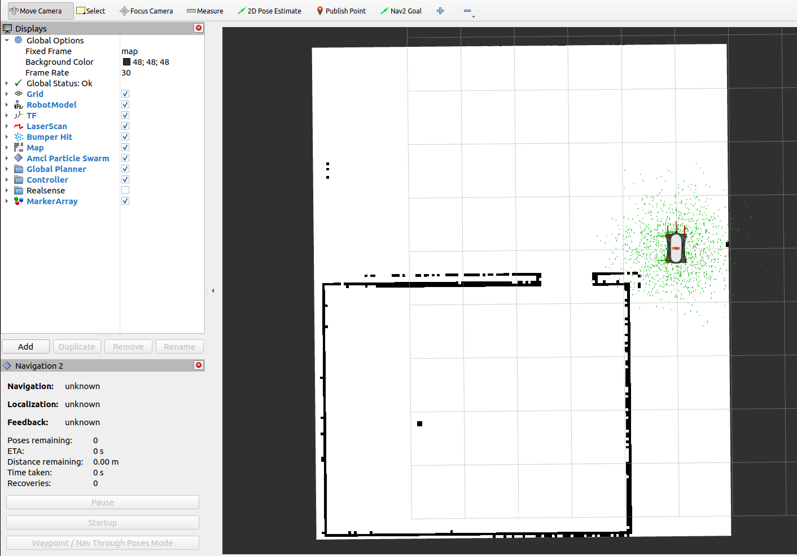
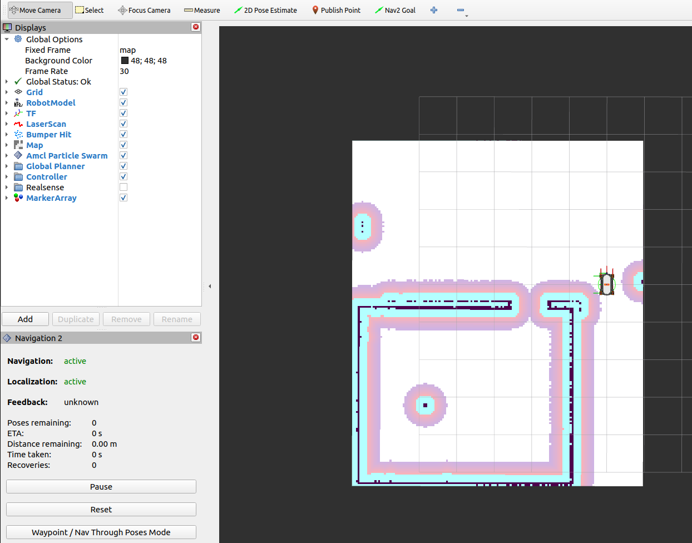
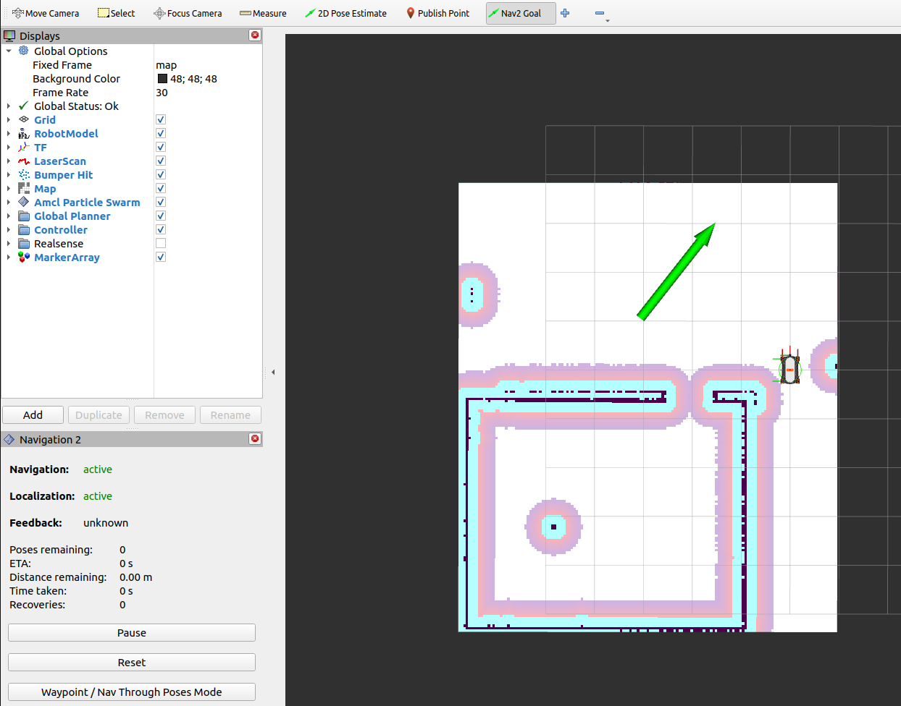
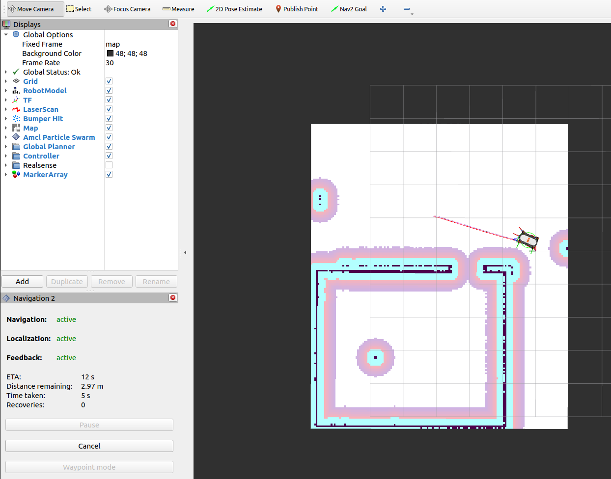

# Requirements

- ROS 2 Humble
- Gazebo classic
- Rviz2

# To run the simlation

Clone the following repository.

```
git clone https://github.com/HBRS-SDP/ss23-youbot_ros2_nav.git
```

Copy all folders to ros_ws/src folder

In a terminal, go to root of ros_ws and run the following command to build the packages

```
colcon build
```

Terminal 1

```
source ~/ros_ws/install/setup.bash 
ros2 launch youbot_gazebo start_world.launch.py
```
The top view of the gazebo world will look like the image shown below



Terminal 2

```
source ~/ros_ws/install/setup.bash
ros2 launch youbot_gazebo spawn_youbot_ros2.launch.xml

```


Terminal 3

```
source ~/ros_ws/install/setup.bash
ros2 run rviz2 rviz2
```
The rviz config file is present in the location `~/src/youbot_description/rviz/navigation.rviz`



Terminal 4

```
source ~/ros_ws/install/setup.bash
ros2 run teleop_twist_keyboard teleop_twist_keyboard
```

From Terminal 4 you can control the robot.

## For Mapping
Terminal 5

```
source ~/ros_ws/install/setup.bash
ros2 launch youbot_navigation online_async_launch.py
```

Terminal 6

Save the generated map using the following command

```
cd ~/ros_ws/src/youbot_navigation/maps
source ~/ros_ws/install/setup.bash
ros2 run nav2_map_server map_saver_cli -f {file_name}
```

Terminal 7

To publish the saved map for navigation

```
source ~/ros_ws/install/setup.bash
ros2 launch youbot_navigation youbot_nav2_bringup.launch.py
```


## For Navigation on a saved map
Kill all the executing commands and close all the opened terminals. Then redo the steps from Terminal 1 and Terminal 2. Then run the following commands.

Terminal 3
```
source ~/ros_ws/install/setup.bash
ros2 launch youbot_navigation youbot_nav2_bringup.launch.py
```


Terminal 4
```
source ~/ros_ws/install/setup.bash
ros2 launch youbot_navigation localization.launch.py
```

After running the above command in terminal 4 use pose estimate in RVIZ to point the robot is the same direction and position where it is present in the gazebo world.


After localizing the youbot in rviz2, the resultant view is shown below



Terminal 5
```
source ~/ros_ws/install/setup.bash
ros2 launch youbot_navigation navigation.launch.py
```


Then in RVIZ window give a 2D Nav Goal and the robot will navigate to the goal.





To navigate the robot to the pre-defined goals (multi-goal navigation) in the map use below commands. The goal coordinates can be found in the .yaml file located at 
- youbot_navigation/maps/navigation_goals_sim.yaml (for simulation) 
- youbot_navigation/maps/navigation_goals.yaml (for real world)

### Single Goal Navigation
Terminal 6
```
source ~/ros_ws/install/setup.bash
ros2 run youbot_navigation single_nav_goal.py
```

<!-- [https://github.com/HBRS-SDP/ss23-youbot_ros2_nav/blob/humble_sim/media/videos/SDP_navgoal.mp4](https://github.com/HBRS-SDP/ss23-youbot_ros2_nav/assets/81406273/bd337fbe-4d1b-42d8-80af-b8f72fb6e0c3) -->

https://github.com/HBRS-SDP/ss23-youbot_ros2_nav/assets/81406273/c14fcb34-7632-4894-9a39-519ac99af83b

### Multi Goal Navigation
Terminal 6
```
source ~/ros_ws/install/setup.bash
ros2 run youbot_navigation multi_nav_goal.py
```

https://github.com/HBRS-SDP/ss23-youbot_ros2_nav/assets/81406273/b338e8f9-eb10-4e8f-a9d5-a71184ccd8e6


